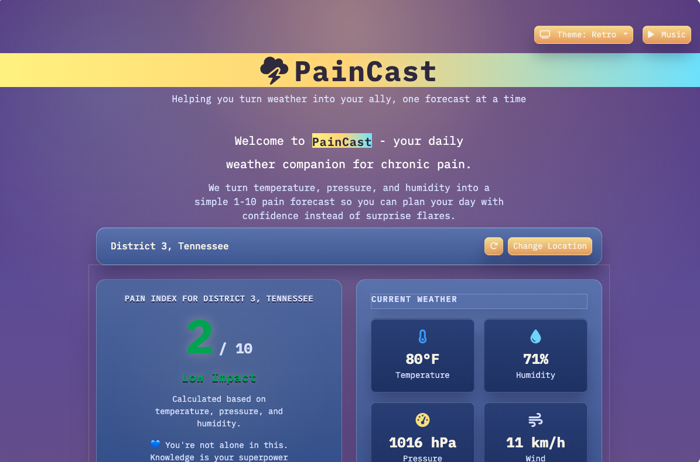
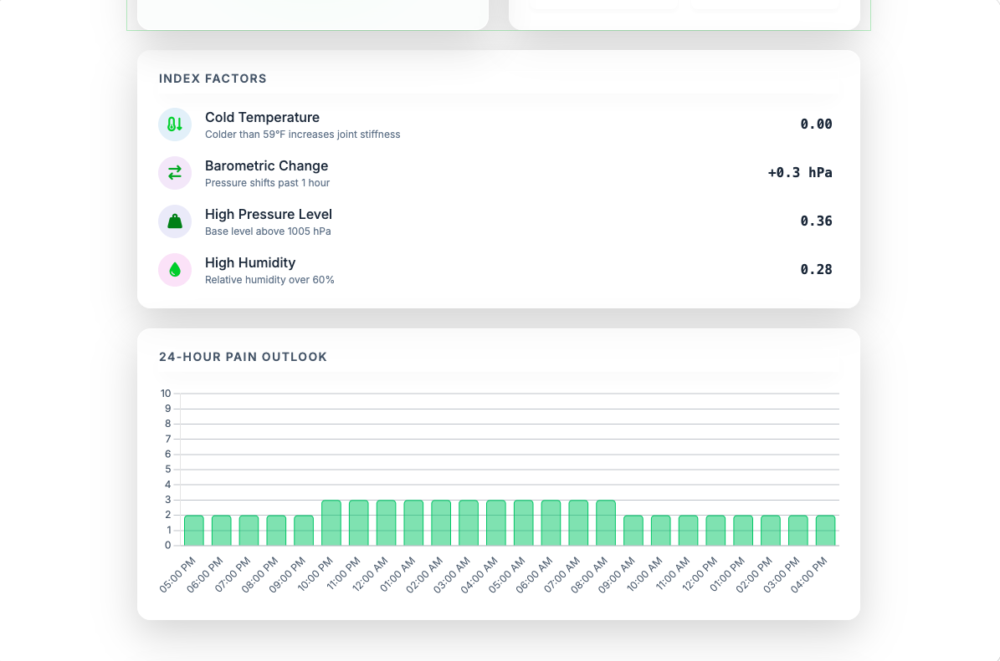
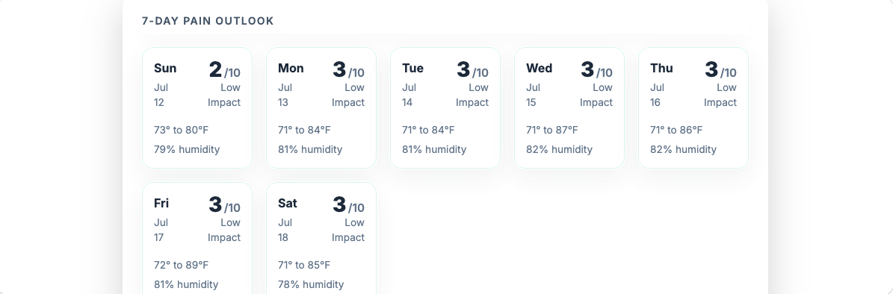

# PainCast 🌩️

**PainCast** is a daily weather companion designed for individuals living with chronic pain (such as weather-sensitive joint stiffness, arthritis, or migraines). It addresses the unpredictability of flare-ups by translating complex local weather data—including temperature shifts, barometric pressure changes, and relative humidity—into a simple 1–10 weather-based pain estimate index. By helping users anticipate how incoming weather patterns might interact with their body, PainCast allows them to plan their day with more confidence.

---

### 🔗 Live Demo
Visit the live, client-side application directly in your browser:
👉 **[https://madebytommi.github.io/paincast/](https://madebytommi.github.io/paincast/)**

---

## 📸 Screenshots

### Main Dashboard (Retro Theme - Default)


### Main Dashboard (Light Theme)


### 7-Day Pain Outlook


---

## 📊 How the Pain Index Works

PainCast uses a client-side heuristic model to weigh environmental factors that chronic pain sufferers frequently report as triggers for physical discomfort. The index evaluates:

- **Temperature:** Discomfort weights increase as temperatures drop below 59°F, which can contribute to joint stiffness.
- **Humidity:** Elevated humidity levels (above 60% relative humidity) increase the index weighting.
- **Atmospheric Pressure:** Higher baseline barometric pressure (above 1005 hPa) slightly increases the base index.
- **Short-Term Pressure Changes:** The magnitude of barometric pressure shifts over the preceding hour. Sudden rises or drops in pressure are heavily weighted, as barometric swings are common triggers for migraines and joint flares.

> [!IMPORTANT]
> **Medical Disclaimer:** The scoring model is a heuristic rule-of-thumb based on general observational weather studies. It is **not** a medically validated diagnostic model, nor does it predict or determine biological pain. Weather sensitivity is highly individual, and this tool is intended solely for personal planning, not as professional medical advice.

## 🔒 Privacy

PainCast is designed with user privacy in mind. Here is a high-level overview of how your data is handled:

- **No Application Backend:** PainCast is a purely static client-side web application. PainCast itself does not maintain a remote user account, user tracking system, or location database.
- **Direct API Queries to Third Parties:**
  - **Weather Requests:** Weather forecast queries are sent directly from your browser to **Open-Meteo**.
  - **Manual Location Searches:** Text queries for manual location entry are sent directly to **OpenStreetMap** (using the Nominatim geocoding API).
  - **Auto-Location Detection:** If you authorize the browser geolocation prompt, your coordinates are sent to **BigDataCloud**'s reverse-geocoding API to resolve them into a readable city name for dashboard display.
- **Data Sharing & Third-Party Policies:** When your browser requests data from these external services, they receive the information necessary to fulfill the request (such as your IP address, coordinates, or text queries). These requests are governed by each provider's respective privacy policy.
- **Local Storage:** Your selected location, latitude/longitude coordinates, search choices, and theme selections are stored strictly on your local device using the browser's `localStorage` for your convenience. No personal information is stored remotely or tracked by PainCast.

---

## ⚙️ Running Locally

Since the application is purely static, you can run it locally without installing any node dependencies or build chains:

1. **Clone the repository:**
   ```bash
   git clone https://github.com/madebytommi/paincast.git
   ```
2. **Open index.html:**
   Simply double-click `index.html` to open it directly in any modern web browser.
3. **Serve (Optional):**
   To test geolocation features more reliably (which browser security may restrict on local file protocols), serve the directory using a simple local server:
   - Python: `python3 -m http.server 8000`
   - Node: `npx serve`

---

## 🛠️ Technologies Used

PainCast is built using lightweight, frontend technologies:

- **HTML5 & CSS3**
- **Vanilla JavaScript** (ES6+)
- **[Bootstrap 5.3](https://getbootstrap.com/)**: For responsive layout grid and structural UI components.
- **[Chart.js](https://www.chartjs.org/)**: Renders the interactive 24-hour pain forecast bar graph.
- **[FontAwesome 6](https://fontawesome.com/)**: Iconography.
- **[Open-Meteo API](https://open-meteo.com/)**: Retrieves free, open-source weather forecasting data without requiring API keys.
- **OpenStreetMap Geocoding (Nominatim)**: Resolves user-entered cities or zip codes into coordinates.

---

## ⚠️ Limitations

- **General Heuristics:** The calculation uses a static mathematical approximation. It does not adapt to individual profiles, clinical diagnoses, or specific chronic pain types (e.g., fibromyalgia vs. rheumatoid arthritis).
- **Forecast Deviations:** Weather forecasts are predictions. Discrepancies between forecasted parameters and actual micro-climates can affect index relevance.
- **Nominatim Geocoding Limits:** The search relies on a public OpenStreetMap geocoding instance, which is rate-limited and intended for low-concurrency personal use.

---

## 🎨 Notable Design Choices

- **Serverless / No API Keys:** Avoids developer or user credential management by selecting fully open and keyless public APIs.
- **Slate & Glassmorphism Aesthetics:** Designed to minimize screen glare and eye strain for light-sensitive individuals, utilizing dark mode by default with CSS theme-switching (light, dark, retro, and high contrast).
- **Empathy-First Copy:** Focuses on supportive, constructive language to help users manage their conditions with actionable context.

---

## 📝 Status & Licensing

- **Project Status:** Functional personal project; actively refined.
- **Music Credit:** Audio track provided by [Monume](https://pixabay.com/users/monume-44679891/) via [Pixabay](https://pixabay.com/music/).
- **License:** See the included license text files for asset details.
